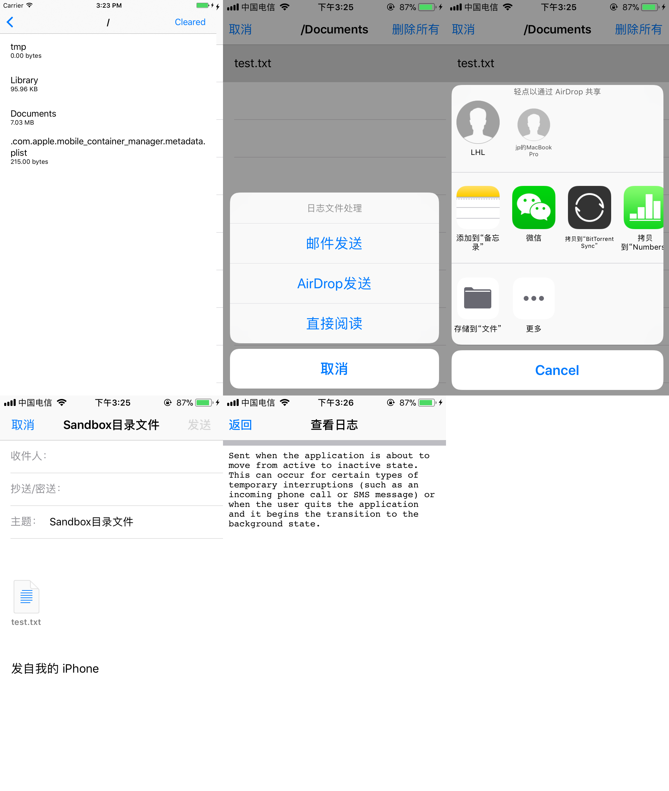
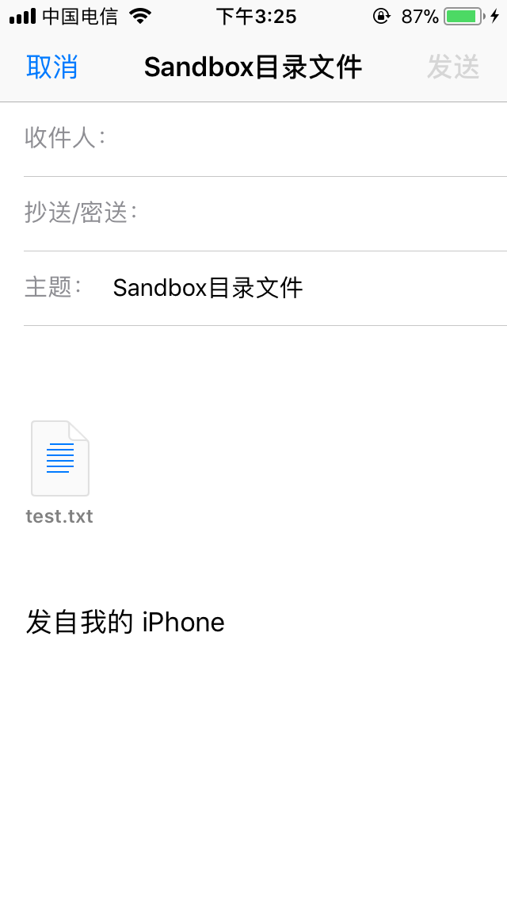

# SendSandBoxFileDemo
遍历沙盒目录下文件，如果是非文件夹。则发送邮件  . 
使用方法 
```objc
    FileListTableViewController *fileListVC = [[FileListTableViewController alloc] init];
    [self.navigationController pushViewController:fileListVC animated:YES];
```
或者
```objc
    FileListTableViewController *fileListVC = [[FileListTableViewController alloc] init];
    [self presentViewController:fileListVC animated:YES completion:nil];
```

效果图





